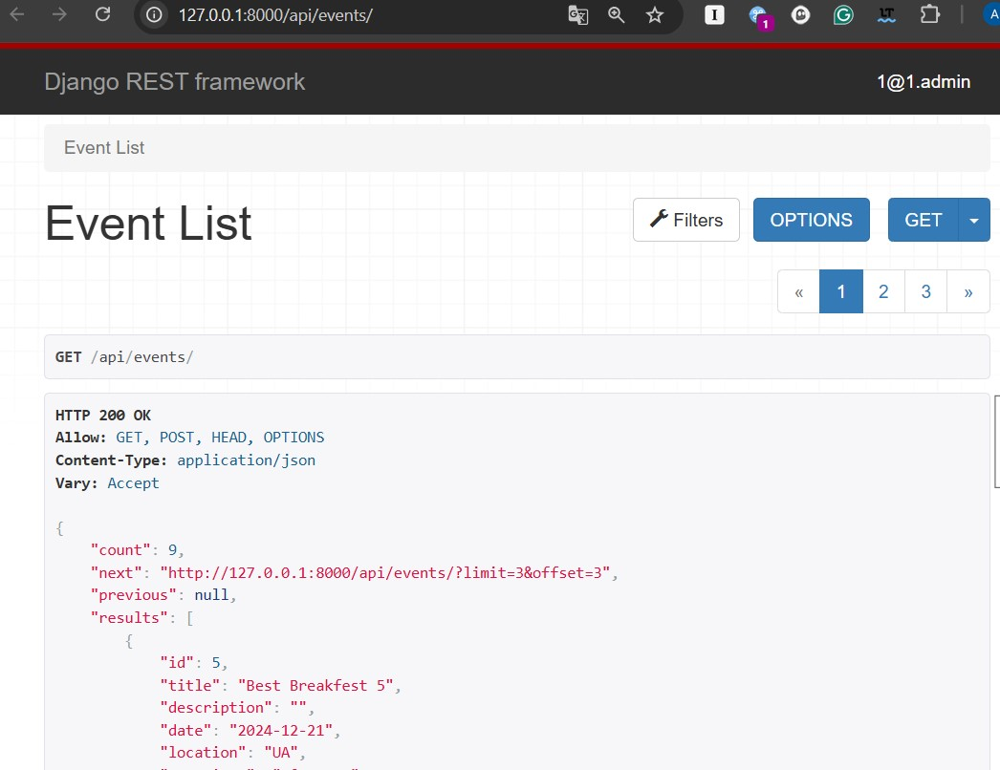
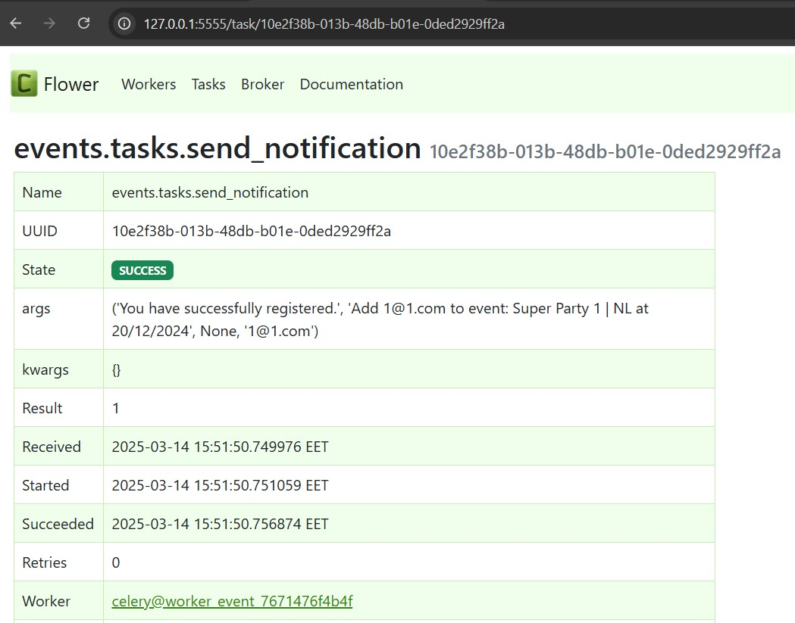
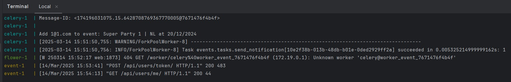

# Event Management API 

Event Management service RESTful API is based on Django REST Framework and suitable for managing events (like conferences, meetups, etc.).
Managing instances of books, tracking book borrowings for fee, payments accounting and support payment sessions - 
make the service much more user-friendly.

The application allows users to create, view, update and delete events. It should also handle user registrations & unregistration 
for these events.


### Features:
- Events managing - full CRUD functional
- Permissions: all users (including non authorized) can get events & only owner (or admin) can crud
- Authorized user can register / unregister for event
- Filtering by dates
- Search by main fields (title, description, location)
- Pagination of events list
- Managing Users & access rights
- Jwt Token Authorization
- Asynchronous Notifications via sending email to users upon event registration/unregistration  (used Console EmailBackend as development)
- Admin panel: /admin/
- Documentation at: /api/schema/swagger-ui/

___
### Tech Stack & System requirements :

* Python 3.+
* Django 5.+ 
* Django Rest Framework (DRF) 3.+ 
* JWT Token Authentication
* SQLite (as development local base for prototyping) 
* Celery (used as asynchronous sending email notifications)
* Redis (used as a Broker & Backend)
* Flower (monitoring for Celery)
* Drf spectacular (Swagger UI documentation)
* Docker Containerization

---
### Installation using GitHub
- Python3 must be already installed

1. Clone GitHub repository:
```
https://github.com/u123dev/event-management.git
```
  - Get the link by clicking the `Clone or download` button in repo

2. Open the project folder in your IDE

or 
```
cd event_management
```
3. Make virtual environment and install requirements in it:
```
py -m venv venv
venv\Scripts\activate (on Windows)
# or
source venv/bin/activate (on macOS)
pip install -r requirements.txt
```
4. DATABASE:
- It is used built-in SQlite as prototype

5. Migrate & make database:
```
py manage.py migrate
```
6. To create demo admin user:
```
py manage.py createsuperuser
```
7. Run Redis Server: 
```
docker run -d -p 6379:6379 redis
```
8. Run Celery Worker (as a separate service): 
```
celery -A event_management worker -l -E info -n worker_event_%n
```
9. Run Flower (Celery monitoring):
```
celery -A event_management flower
```
10. Run Project:
```
py manage.py runserver
```
 
---

### Run with Docker containers
 System requirements:

* **Docker Desktop 4.+**

Run project:
```
docker-compose up --build
```

### Getting access:
1. Access API Services in browser (main entries):
   - [http://127.0.0.1:8000/api/events/](http://127.0.0.1:8000/api/events/)
   - [http://127.0.0.1:8000/api/users/](http://127.0.0.1:8000/api/users/)

2. Access Flower / Celery tasks monitoring:
   - [http://127.0.0.1:5555/tasks/](http://127.0.0.1:8000/5555/tasks/)

3. Admin panel:
   - [http://127.0.0.1:8000/admin/](http://127.0.0.1:8000/admin/)

4. Register new user:
   - **api/user/** 

5. Obtain pair an access authentication & refresh tokens by sending a POST user credentials - email(as login) & password: 
   - **api/user/token/** 

6. Header to access endpoints:
   - **Authorize: Bearer *<Access Token>***


### Documentation 
 
Swagger via:
- **api/schema/swagger-ui/** 

Redoc via:
  - **api/doc/redoc/**

### Demo







### Contact
Feel free to contact: u123@ua.fm
